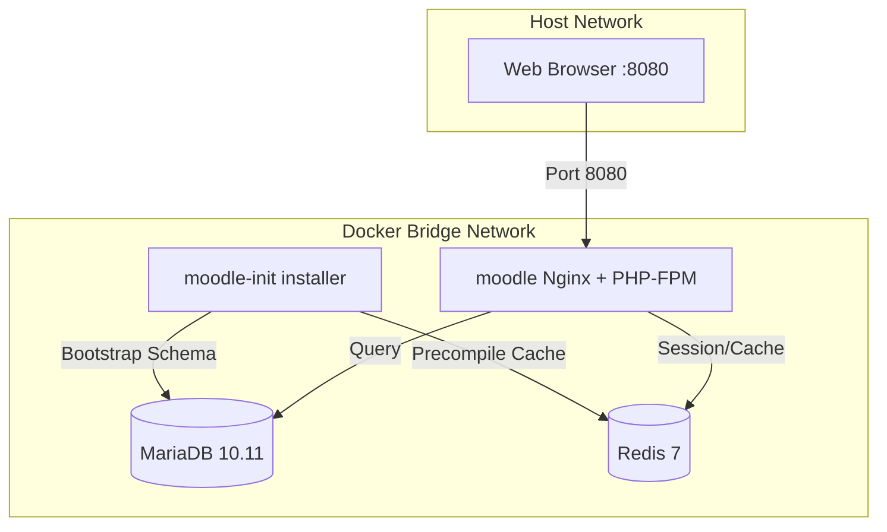

# 🚀 Optimized Moodle Nginx Container

[](https://github.com/ADORSYS-GIS/moodle-container/actions/workflows/publish-image.yml)
[](https://hub.docker.com/_/alpine)
[](https://www.php.net/)
[](https://nginx.org/)

A production-grade, highly optimized, and hardened Docker setup for **Moodle** powered by **Alpine Linux**, **Nginx**, and **PHP 8.2 (FPM)**. This project is meticulously engineered for secure, scalable, cloud-native enterprise deployments.

---

## 📖 Navigating the Documentation
To maintain clean, professional documentation, we have separated high-level project overviews from deep-dive technical manuals:
* 🚀 **[Getting Started Guide](GETTING_STARTED.md)**: Detailed local developer setup, step-by-step installation commands, complete environment variable reference, and troubleshooting.
* 📚 **Technical Docs**: [docker-image](docs/docker-image.md) · [nginx-php-configs](docs/nginx-php-configs.md) · [objectfs](docs/objectfs.md) · [redis-integration](docs/redis_integration.md)

---

## ☸️ Helm Chart

This repository hosts a Helm chart published via **GitHub Pages** using the [chart-releaser-action](https://helm.sh/docs/howto/chart_releaser_action/). Chart releases are automated — every push to `main` that changes `charts/moodle/**` triggers the workflow, which publishes a GitHub Release and updates the `gh-pages` branch index.

### Quick start

```bash
helm repo add moodle https://adorsys-gis.github.io/moodle-container
helm repo update
helm install my-moodle moodle/moodle
```

> Full configuration reference and examples: [charts/moodle/README.md](charts/moodle/README.md)

---

## ✨ Enterprise Features

* **⚡ Ultra High Performance**: Nginx communicates with PHP-FPM 8.2 over optimized Unix domain sockets for near-zero latency overhead.
* **⚙️ Minimal Footprint**: Built entirely on lightweight Alpine Linux (v3.19) keeping your deployment footprints slim.
* **🔋 Advanced Distributed Caching**: Out-of-the-box support for Redis session persistence, application multi-level cache backend, and locking factories.
* **🛡️ Hardened Sandbox Security**: Rigid permission boundaries where application compromises (`www`) can never modify system startup shell scripts (`root`).
* **📦 Built-in Antivirus Protection**: Seamless integrated ClamAV daemon ready to scan and sandbox uploaded files on the fly.
* **🔧 CLI Administration**: Bundled with Moosh (Moodle Shell) for automated scripting, database schema updates, and instant configurations.
* **🤖 Single-Source CI/CD**: Seamless GitHub Actions workflows that automatically synchronize published image tags with Moodle core versions declared inside the Dockerfile.

---

## 📂 Project Structure

```text
moodle-container/
├── .github/
│   └── workflows/
│       ├── publish-image.yml     # Manual CI/CD release workflow targeting GHCR
│       ├── release-chart.yml     # Automated Helm chart release to gh-pages
│       └── test-build.yml        # Dry-run compilation test on push/PR
├── charts/
│   └── moodle/                   # Helm chart (see charts/moodle/README.md)
│       ├── templates/
│       ├── Chart.yaml
│       └── values.yaml
├── base/                         # Base configuration templates
│   ├── etc/
│   │   ├── nginx/
│   │   │   ├── fastcgi_params
│   │   │   ├── mime.types
│   │   │   └── nginx.conf-template
│   │   └── php82/
│   │       ├── php-fpm.d/
│   │       │   └── moodle.conf   # Optimized PHP-FPM Moodle pool
│   │       ├── php-fpm.conf
│   │       └── php.ini-template  # Standardized PHP configuration
│   ├── moodle/
│   │   └── local/
│   │       └── defaults.php
│   └── opt/
│       ├── entrypoint.sh         # Custom Alpine entrypoint
│       └── setup_moodle.sh       # Comprehensive Moodle auto-installer/upgrader
├── compose.yaml                  # Local development compose setup (MariaDB + Redis)
├── config.php.template           # Production-ready config.php template
├── Dockerfile                    # Multi-stage Alpine 3.19 build file
├── GETTING_STARTED.md            # Developer onboarding & configuration manual
└── README.md                     # Executive project index
```

---

## 🧱 Architectural Topology

This environment utilizes a decoupled start topology, isolating installation stages from production web servers to ensure system reliability:



For step-by-step guides on local compose configuration, environment variables custom mapping, and running shell commands, please proceed to the **[Getting Started Guide](GETTING_STARTED.md)**.

---

## 📄 License

This project is licensed under the Apache License 2.0. See [LICENSE](LICENSE) for more details.