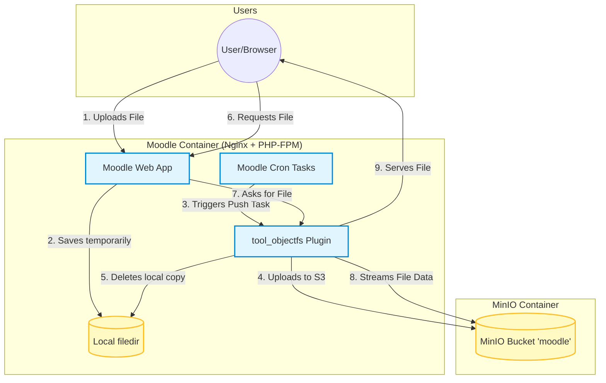

# ObjectFS in Moodle (tool_objectfs)

## 1. What is ObjectFS?
**ObjectFS** (`tool_objectfs`) is an alternative file system plugin for Moodle. By default, Moodle stores all uploaded files (course materials, user avatars, assignment submissions) in the local `moodledata/filedir` directory. 

ObjectFS changes this behavior by intercepting Moodle's file storage operations and transparently offloading those files to remote Object Storage (like Amazon S3 or MinIO). 

### Key Benefits:
- **Saves Local Disk Space:** Files are pushed to MinIO and eventually deleted from the local server.
- **Scalability:** Object storage can hold vastly more data than a standard local disk.
- **Statelessness:** Makes your Moodle application containers more stateless, allowing you to run multiple Moodle replicas that all share the same external file storage without relying on network file systems (NFS).

## 2. Architecture & File Lifecycle Diagram

Below is a diagram illustrating how ObjectFS handles file uploads, syncs them to MinIO, and serves them to users within this Docker project.



## 3. How it is Configured in this Project

The ObjectFS integration is fully automated via Docker. Here are the key file references and how they contribute to the setup:

### A. Downloading the Plugin
- **File:** `compose.yaml` (Service: `objectfs-downloader`)
- **File:** `.docker/plugin-downloader/download_tool_objectfs.sh`
- **Role:** Before Moodle starts, an Alpine Git container downloads the `MOODLE_404_STABLE` branch of the `tool_objectfs` plugin into a Docker volume (`objectfs_plugin`). This volume is then mounted into the Moodle container at `/moodleroot/moodle/admin/tool/objectfs`.

### B. Environment Configuration
- **File:** `compose.yaml` (Service: `moodle` and `objectfs-init`)
- **Role:** The Docker Compose file defines the environment variables required by ObjectFS to connect to the local MinIO instance:
  ```yaml
  ENABLE_OBJECTFS: "yes"
  OBJECTFS_S3_KEY: minioadmin
  OBJECTFS_S3_SECRET: minioadmin
  OBJECTFS_S3_BUCKET: moodle
  OBJECTFS_S3_BASE_URL: http://minio.local:9000
  OBJECTFS_DELETE_LOCAL: "yes"
  ```

### C. Moodle Initial Configuration
- **File:** `.docker/objectfs/configure_objectfs.php`
- **Role:** This PHP CLI script runs during the `objectfs-init` phase. It reads the environment variables (like `OBJECTFS_S3_BUCKET`) and injects them directly into Moodle's database configuration table (`mdl_config_plugins`). It ensures the S3 client is configured without manual Admin GUI intervention.
- **Key Setting:** It sets Moodle's `filesystem` variable to `\tool_objectfs\s3_file_system`, which officially activates the plugin to intercept file reads/writes.

### D. File Serving (The Read Path)
- **File:** `base/etc/php82/php-fpm.d/moodle.conf`
- **Role:** ObjectFS uses PHP's `readfile()` function with a custom `s3://` stream wrapper to stream files from MinIO to the user. For this to work, PHP must be allowed to open URLs as files. We ensure `php_admin_flag[allow_url_fopen] = on` is set so the stream wrapper functions correctly, preventing 404 errors.

## 4. Summary of Operations
1. **Upload:** When a user uploads a file, Moodle writes it to the local disk (`moodledata/filedir`).
2. **Transfer:** Moodle's Cron executes `\tool_objectfs\task\push_objects_to_external`. This task finds new local files, uploads them to MinIO, and updates the database to mark their location as "External".
3. **Cleanup:** If `OBJECTFS_DELETE_LOCAL` is enabled (as it is in this project), the file is then deleted from the local disk.
4. **Download:** When requested, Moodle checks if the file is local. If not, the `tool_objectfs` plugin uses the `s3://` wrapper to securely fetch the bytes from MinIO and stream them back to the user seamlessly.
